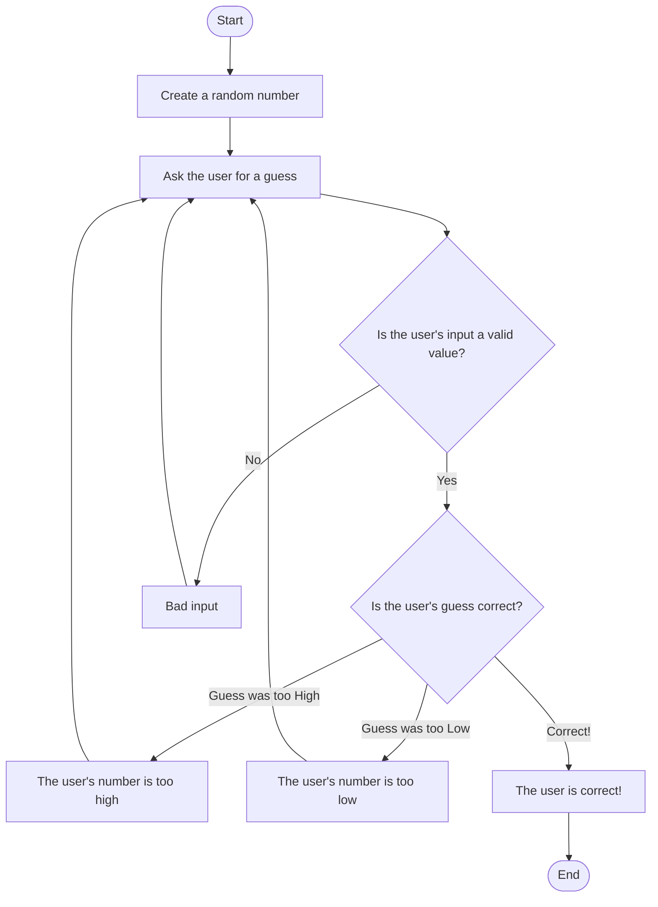

## Step by step guide for my Guessing Game Diagram

**Start**: The Guessing Game program starts!

Create a Random Number: The program then creates a random number within a certain range.

Prompt: The user is asked to input their guess.

Check if the user's input is valid:
*	IF the user’s input is _valid_-- a numeric value that’s within range-- then go to the next step.
*	IF the user’s input is _invalid_ then display an error message and go back to the beginning and prompt the user for another guess.

Check whether or not the guess is correct:
*	IF the user’s guess is **_accurate_**, then display a **success** message and go to the end of the game.
*	IF the user’s guess is **_too high_**, then I will display a message letting the user know that their value failed for being **too high** and then go back to the prompt to **guess again**.
*	IF the user’s guess is **_too low_**, then I will display a message letting the user know that their value failed for being **too low** and then go back to the prompt to **guess again**.

**End**: The program concludes once the user has correctly guessed the value!
