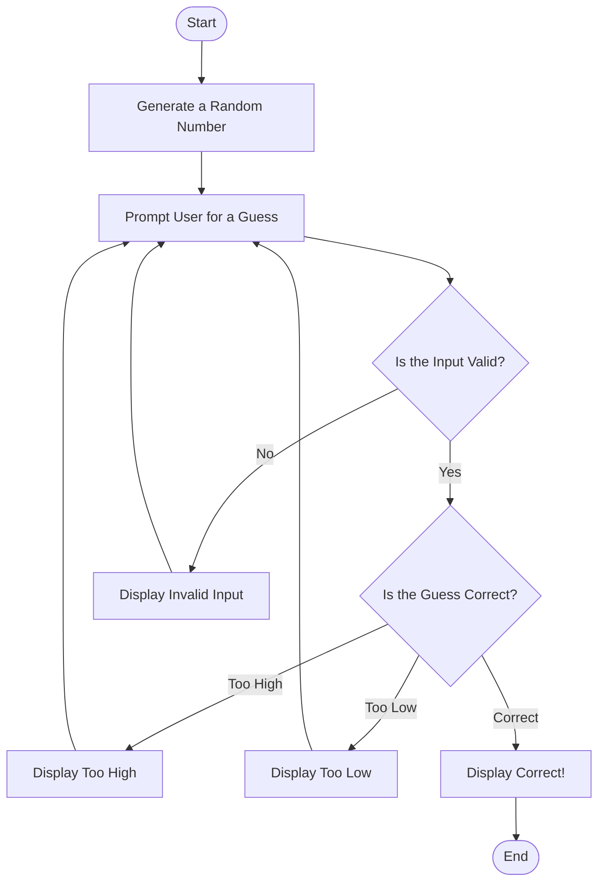

```mermaid
flowchart TD
    Start([Start]) --> A[Generate a Random Number]
    A --> B[Prompt User for a Guess]
    B --> C{Is the Input Valid?}
    C -- "Yes" --> D{Is the Guess Correct?}
    C -- "No" --> E[Display Invalid Input]
    E --> B
    D -- "Too High" --> F[Display Too High]
    F --> B
    D -- "Too Low" --> G[Display Too Low]
    G --> B
    D -- "Correct" --> H[Display Correct!]
    H --> End([End])
```
