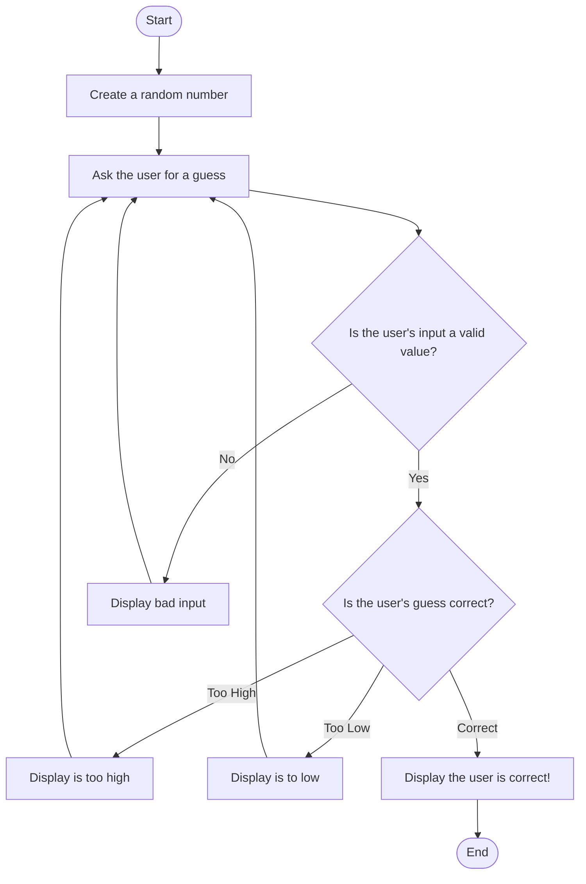

## Step by step guide for my Guessing Game Diagram

**Start**: The Guessing Game program starts!

Create a Random Number: The program then creates a random number within a certain range.

Prompt the user for a guess: The user is asked for their guess.

Now we check if the input is valid:
*	IF the user’s input is _valid_-- a numeric value that’s within range-- then proceed to the next step.
*	IF the user’s input is _invalid_ then display an error message and go back to prompting the user again.

Is the Guess Correct?:
*	IF the user’s guess is _accurate_, then display a **success** message and go to the end of the game.
*	IF the user’s guess is _too high_, then I will inform the user and **ask them to guess again**.
*	IF the user’s guess is _too low_, then I will inform the user and **ask them to guess again**.

**End**: The program concludes once the user has correctly guessed the value!
