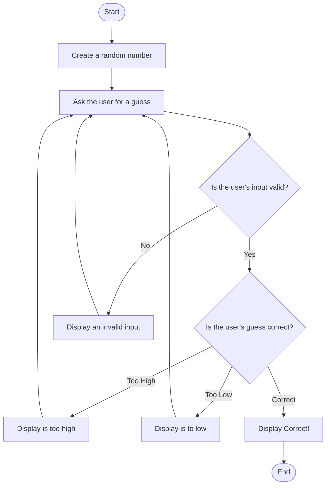

```mermaid
flowchart TD
    Start([Start]) --> A[Create a random number]
    A --> B[Ask the user for a guess]
    B --> C{Is the user's input valid?}
    C -- "Yes" --> D{Is the user's guess correct?}
    C -- "No" --> E[Display an invalid input]
    E --> B
    D -- "Too High" --> F[Display is too high]
    F --> B
    D -- "Too Low" --> G[Display is to low]
    G --> B
    D -- "Correct" --> H[Display Correct!]
    H --> End([End])
```
